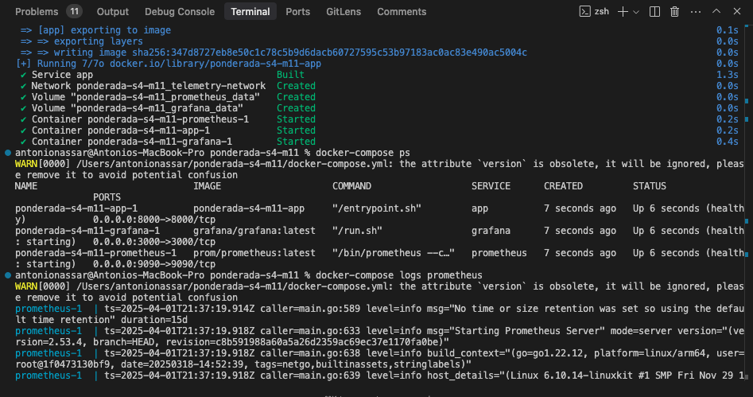
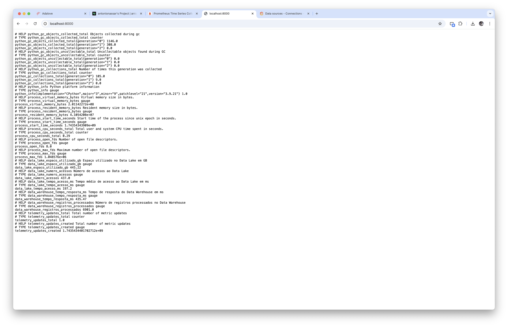
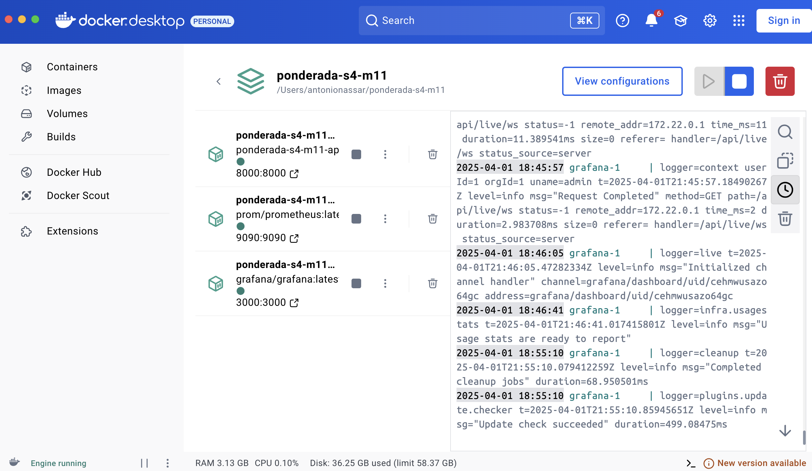
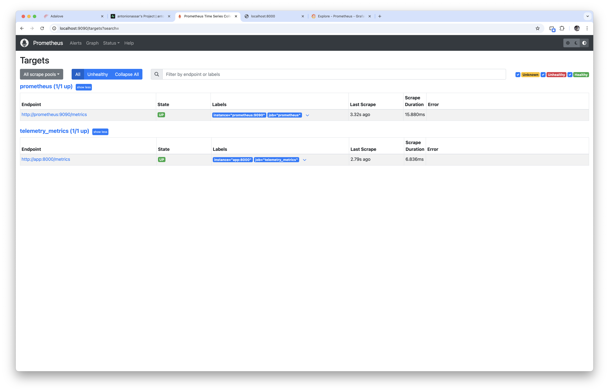
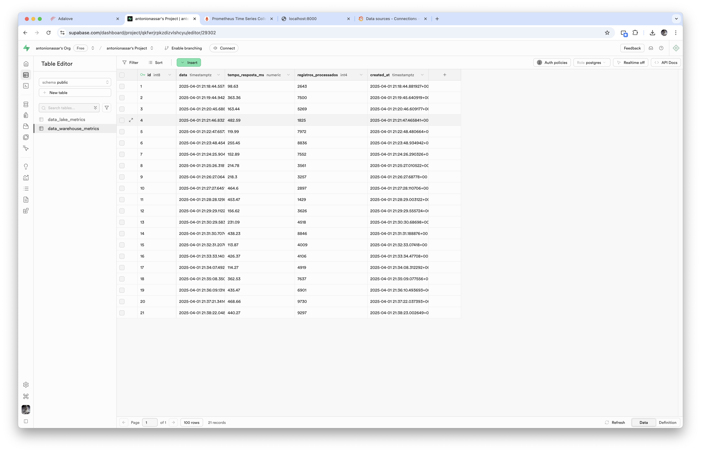
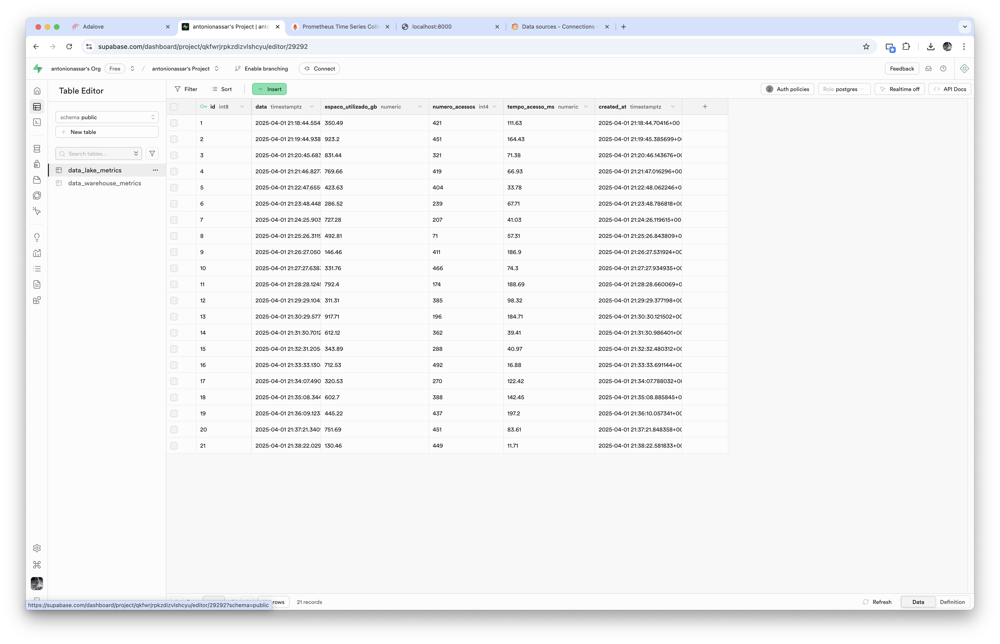
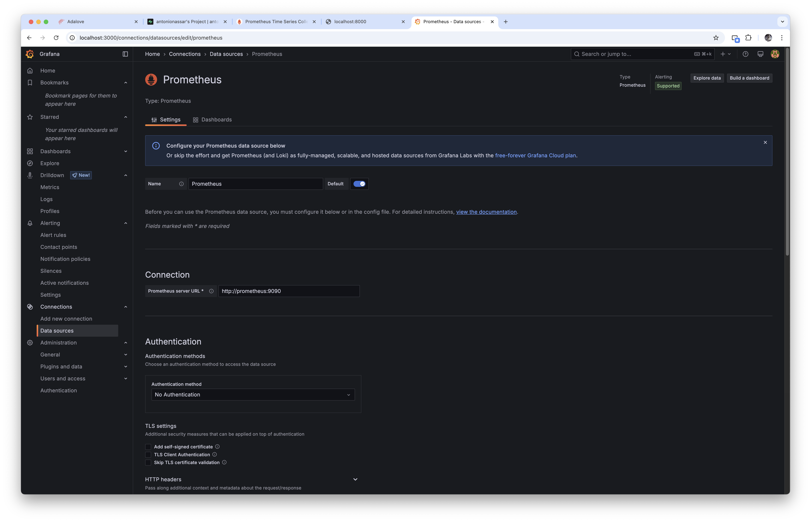
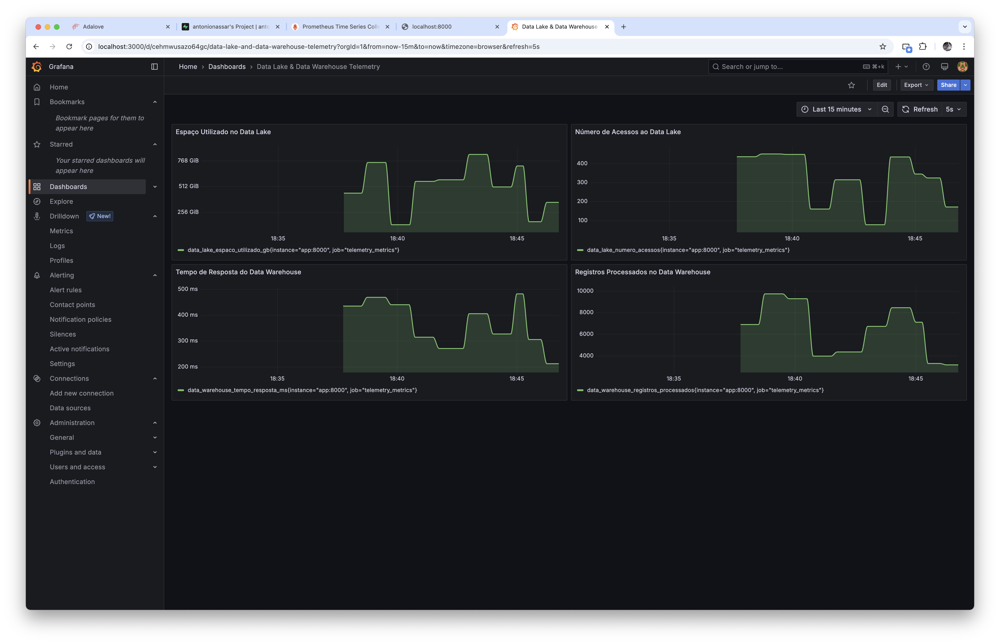

# Dashboard de Telemetria para Data Lake & Data Warehouse

## Visão Geral

Este projeto implementa um sistema de monitoramento em tempo real para Data Lake e Data Warehouse, utilizando Prometheus para coleta de métricas e Grafana para visualização. O Supabase é utilizado como backend para persistência dos dados coletados, garantindo o armazenamento histórico das métricas. O objetivo principal é fornecer visibilidade e insights operacionais sobre o funcionamento destes componentes críticos de uma infraestrutura de dados. As métricas foram simuladas para propósitos demonstrativos.

### Métricas Monitoradas

O sistema monitora quatro métricas críticas divididas entre Data Lake e Data Warehouse:

#### Data Lake

- **Espaço Utilizado (GB)**: Monitora o volume total de dados para planejamento de capacidade e otimização de custos
- **Número de Acessos**: Contabiliza requisições para análise de padrões de uso e dimensionamento

#### Data Warehouse

- **Tempo de Resposta (ms)**: Mede a latência das operações para garantia de SLAs e otimização
- **Registros Processados**: Monitora throughput para análise de eficiência e capacidade

### Arquitetura da Solução

A solução foi construída utilizando:

1. **Python**

   - Aplicação que simula e expõe as métricas
   - Endpoint `/metrics` no formato do Prometheus
   - Integração com Supabase para persistência dos dados

2. **Prometheus**

   - Sistema de coleta e armazenamento de métricas
   - Scraping automático dos endpoints
   - Armazenamento temporal das métricas

3. **Grafana**

   - Interface de visualização
   - Dashboards customizados
   - Alertas e notificações (configurável)

4. **Supabase**
   - Banco de dados PostgreSQL gerenciado
   - Armazenamento persistente das métricas coletadas
   - API RESTful para acesso aos dados históricos
   - Autenticação e autorização integradas

## Estrutura do Projeto

O projeto consiste em três componentes principais:

- Aplicação de métricas (Python/FastAPI)
- Prometheus (Coleta de métricas)
- Grafana (Visualização)

---

## Para Executar:

1. Clone o repositório
2. Configure as variáveis de ambiente do Supabase:

```bash
SUPABASE_URL=sua_url
SUPABASE_KEY=sua_chave
```

3. Execute:

```bash
docker-compose up -d
```

4. Acesse:

- Grafana: http://localhost:3000 (admin/admin)
- Prometheus: http://localhost:9090
- Métricas: http://localhost:8000/metrics
- Supabase Dashboard: URL do seu projeto

## Métricas Disponíveis

- `data_lake_espaco_utilizado_gb`: Espaço utilizado no Data Lake em GB
- `data_lake_numero_acessos`: Número de acessos ao Data Lake
- `data_warehouse_tempo_resposta_ms`: Tempo de resposta do Data Warehouse em ms
- `data_warehouse_registros_processados`: Quantidade de registros processados

## Troubleshooting

Se encontrar problemas com os targets do Prometheus:

1. Verifique se os serviços estão rodando: `docker-compose ps`
2. Verifique os logs: `docker-compose logs prometheus`
3. Teste o acesso às métricas: `curl http://localhost:8000/metrics`
4. Verifique a configuração em `prometheus.yml`

---

## Prints de Execução

### 1. Inicialização dos Containers

Iniciamos a aplicação utilizando Docker Compose para orquestrar todos os serviços necessários:

```bash
docker-compose up -d
```

O comando inicia a aplicação que expõe as métricas no endpoint (localhost:8000)



Verificamos a configuração inicial do ambiente com as métricas expostas:



### 2. Verificação dos Serviços Docker

Confirmação de que todos os containers necessários estão em execução e saudáveis:



Na imagem, podemos observar que todos os serviços essenciais (app, prometheus e grafana) estão rodando corretamente, indicando que a infraestrutura base está pronta para uso.

### 3. Configuração e Verificação do Prometheus

Durante a configuração do Prometheus, identificamos um problema inicial com o status "UNKNOWN" dos targets. Após os ajustes necessários na configuração do Prometheus (atualização do nome do serviço de `localhost` para `prometheus`), os targets passaram a funcionar corretamente:



### 4. Verificação de Tabelas no Supabase

Realizamos a verificação das tabelas no Supabase para garantir que os dados estão sendo armazenados corretamente e que as métricas estão sendo coletadas conforme esperado:



A estrutura do banco de dados no Supabase permite consultas e análises das métricas:



### 5. Configuração do Datasource

A integração entre Prometheus e Grafana foi estabelecida através da configuração do datasource:



### 6. Dashboard Final

O resultado final apresenta todos os painéis funcionando e coletando dados em tempo real, oferecendo uma visão completa das métricas do Data Lake e Data Warehouse:



O dashboard final inclui visualizações para:

- Monitoramento do espaço utilizado no Data Lake
- Contagem de acessos ao Data Lake
- Tempo de resposta do Data Warehouse
- Quantidade de registros processados

## Conclusão

Este projeto demonstra com sucesso a implementação de um sistema de monitoramento completo para ambientes de Data Lake e Data Warehouse. Através da integração entre FastAPI, Prometheus e Grafana, conseguimos estabelecer uma solução robusta que permite o acompanhamento em tempo real de métricas críticas para o negócio.

A arquitetura containerizada com Docker garantiu a portabilidade e facilidade de implantação, enquanto o dashboard customizado no Grafana proporcionou uma interface intuitiva para visualização das métricas. O sistema não só atende às necessidades técnicas de monitoramento, mas também fornece insights valiosos para tomada de decisões estratégicas relacionadas à infraestrutura de dados, respectivamente.
